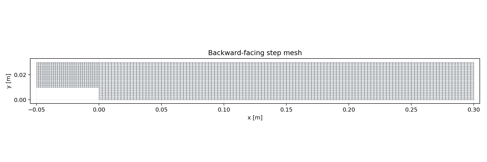
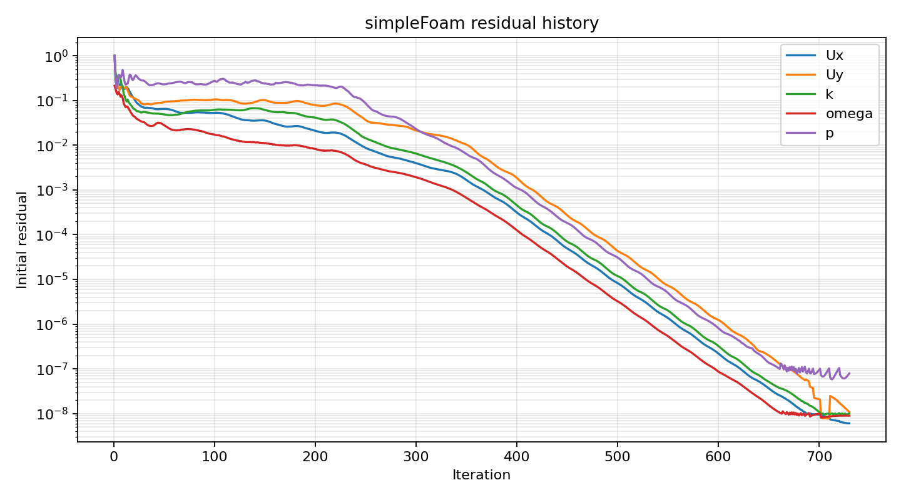
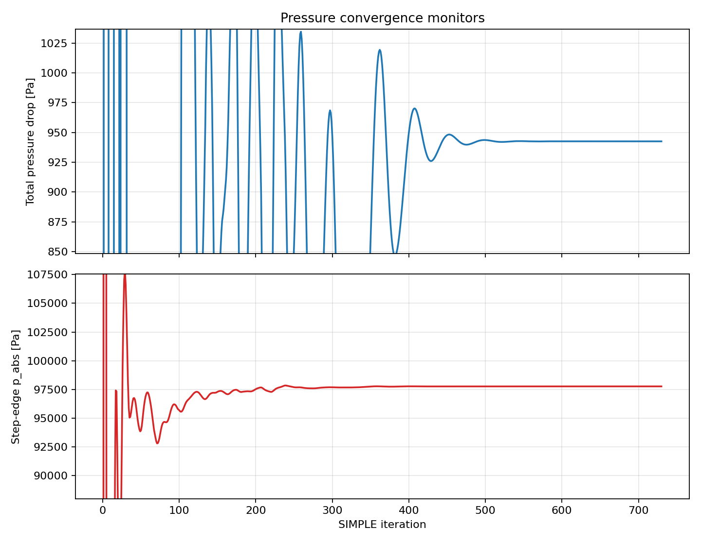
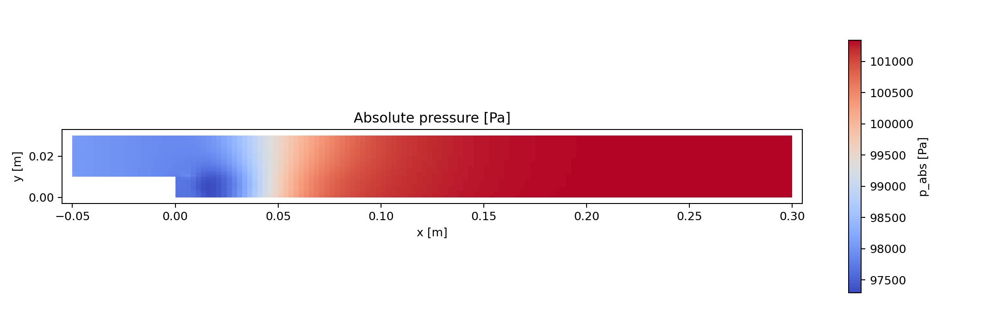

# Backward-Facing Step Baseline Report

## Purpose

This repository is the first OpenFOAM project in a CFD portfolio collection. The intent is to show that established CFD workflow skills transfer cleanly from STAR-CCM+ into OpenFOAM: explicit case dictionaries, repeatable meshing, solver setup, convergence monitoring, and scripted post-processing.

The baseline case is a turbulent backward-facing step. It is small enough to run quickly, but it still exercises the decisions expected in a practical internal-flow CFD study: separated flow, pressure recovery, wall treatment, residual targets, mesh quality checks, and objective convergence monitors.

## Case Setup

The case is built as a steady incompressible RANS simulation with `simpleFoam`.

| Item | Baseline value |
| --- | --- |
| Solver | `simpleFoam` |
| Flow model | Steady incompressible RANS |
| Turbulence model | `kOmegaSST` |
| Kinematic viscosity | `1e-5 m^2/s` |
| Inlet speed | `120 m/s` |
| Pressure reference | Outlet fixed to `p = 0` kinematic pressure |
| Density for reporting | `1.225 kg/m^3` |
| Reference absolute pressure | `101325 Pa` |

OpenFOAM stores pressure for this incompressible case as kinematic pressure. Reporting scripts convert to engineering pressure with:

```text
p_abs = rho*p + p_ref
```

and compute pressure drop using both static pressure and total pressure at the probe locations.

## Geometry

The geometry is a two-dimensional backward-facing step extruded to one cell through the thickness and marked `empty` on the front and back patches.

| Dimension | Value |
| --- | --- |
| Upstream length | `0.05 m` |
| Downstream length | `0.30 m` |
| Step height | `0.01 m` |
| Upstream channel height | `0.02 m` |
| Downstream channel height | `0.03 m` |
| 2D thickness | `0.001 m` |

The geometry is generated directly in `case/system/blockMeshDict` so the project remains portable and reviewable without CAD dependencies.

## Mesh

The baseline mesh is a structured hexahedral `blockMesh` grid split into three logical blocks:

| Region | Cells |
| --- | --- |
| Upstream channel | `30 x 20 x 1` |
| Lower downstream channel | `120 x 10 x 1` |
| Upper downstream channel | `120 x 20 x 1` |

The resulting mesh has:

| Metric | Value |
| --- | --- |
| Cells | `4200` |
| Points | `8762` |
| Faces | `16980` |
| Max aspect ratio | `2.5` |
| Max non-orthogonality | `0` |
| Max skewness | `1.32183e-13` |
| `checkMesh` result | `Mesh OK` |



This initial mesh is intentionally simple and fully structured. It provides a controlled baseline before starting the mesh density study.

## Boundary Conditions

| Patch | Type | Main conditions |
| --- | --- | --- |
| `inlet` | patch | Fixed `U = (120 0 0)`, fixed `k = 54`, fixed `omega = 17400`, zero-gradient `p` |
| `outlet` | patch | Fixed `p = 0`, zero-gradient `U`, `k`, and `omega` |
| `walls` | wall | No-slip `U`, zero-gradient `p`, wall functions for `k`, `omega`, and `nut` |
| `frontAndBack` | empty | Enforces 2D behavior |

The turbulence inlet values are set explicitly in the `0/` fields. Wall functions are used because this baseline is aimed at a compact engineering RANS workflow, not a wall-resolved DNS/LES workflow.

## Numerics

The finite-volume setup uses steady-state discretization with bounded convection schemes:

| Term | Scheme |
| --- | --- |
| Time derivative | `steadyState` |
| Gradients | `Gauss linear` |
| Momentum convection | `bounded Gauss linearUpwind grad(U)` |
| Turbulence convection | `bounded Gauss upwind` |
| Laplacian | `Gauss linear corrected` |

Linear solver choices are conventional for a steady incompressible RANS case:

| Field | Solver |
| --- | --- |
| `p` | `GAMG` |
| `U`, `k`, `omega` | `smoothSolver` with `symGaussSeidel` |

The SIMPLE loop uses `consistent yes` and no non-orthogonal correctors because the mesh is orthogonal.

## Convergence Strategy

The project uses two levels of convergence monitoring:

1. Equation residuals from `case/log.simpleFoam`.
2. Engineering monitors from probes written every SIMPLE iteration.

The residual targets are:

| Field | Target |
| --- | --- |
| `p` | `1e-5` |
| `Ux` | `1e-6` |
| `Uy` | `1e-6` |
| `k` | `1e-6` |
| `omega` | `1e-6` |

The solver does not stop immediately when those targets are reached. `runTimeControl` in `case/system/controlDict` sets a trigger when the residual criteria are met, then runs 200 additional SIMPLE iterations before stopping. In the current baseline run, residual convergence triggered at iteration `530` and the solver stopped at iteration `730`.



## Pressure Monitors

Three probes are written every SIMPLE iteration:

| Probe | Location | Purpose |
| --- | --- | --- |
| Upstream | `(-0.045 0.020 0.0005)` | Reference upstream pressure and velocity |
| Outlet | `(0.295 0.015 0.0005)` | Downstream pressure and velocity |
| Step edge | `(0.001 0.0105 0.0005)` | Local pressure near separation |

The post-processing script computes:

```text
static pressure delta = rho*(p_upstream - p_outlet)
total pressure drop   = rho*((p_upstream + 0.5*|U_upstream|^2)
                            - (p_outlet + 0.5*|U_outlet|^2))
step absolute pressure = rho*p_step + p_ref
```

Final monitored values from the current baseline run:

| Quantity | Value |
| --- | --- |
| Final iteration | `730` |
| Upstream kinematic pressure | `-2685.67 m^2/s^2` |
| Outlet kinematic pressure | `1.45051 m^2/s^2` |
| Step-edge kinematic pressure | `-2904.03 m^2/s^2` |
| Static pressure delta | `-3291.722625 Pa` |
| Total pressure drop | `942.5217573 Pa` |
| Step-edge absolute pressure | `97767.56325 Pa` |



## Pressure Field

The rendered absolute-pressure image is generated directly from the OpenFOAM mesh and field data with `scripts/render_images.py`. This keeps the baseline workflow reproducible without requiring a ParaView GUI session.



## Automation

The repository includes scripts for repeatable execution:

| Script | Purpose |
| --- | --- |
| `scripts/run_case.sh` | Runs `blockMesh`, `checkMesh`, and `simpleFoam` |
| `scripts/clean_case.sh` | Removes generated time directories and logs |
| `scripts/post_process.py` | Extracts residuals, pressure monitors, CSV tables, and plots |
| `scripts/render_images.py` | Generates mesh and pressure images from OpenFOAM data |
| `scripts/render_paraview.sh` | Optional ParaView rendering path |

This separates solver setup from reporting and makes the project easier to extend for design studies.

## Current Status

The baseline case is complete enough to serve as the reference case for the next stage. It has:

- repeatable OpenFOAM setup from dictionaries
- structured mesh generation through `blockMesh`
- validated mesh quality from `checkMesh`
- steady RANS solution with `kOmegaSST`
- residual and engineering convergence monitors
- generated CSV data and plots for GitHub/GitLab review
- automated mesh and pressure figures

## Next Step: Mesh Density Study

The next phase will turn this baseline into a mesh density study. The planned structure is:

1. Create coarse, medium, and fine mesh variants from the same geometry.
2. Keep physics, boundary conditions, schemes, and residual targets fixed.
3. Run each mesh until residual convergence plus 200 additional SIMPLE iterations.
4. Compare final total pressure drop, step-edge pressure, and residual behavior.
5. Add velocity profile sampling and reattachment-length extraction once the mesh variants are in place.

The mesh density study will establish whether the reported pressure metrics are mesh independent enough for a portfolio validation case.
