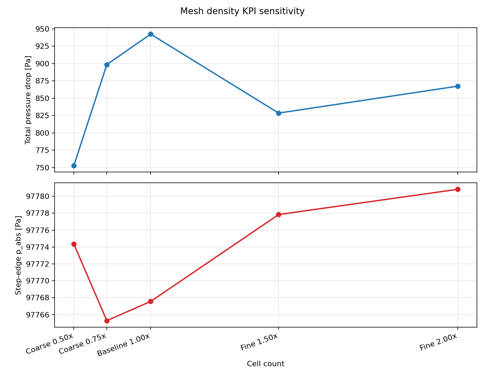
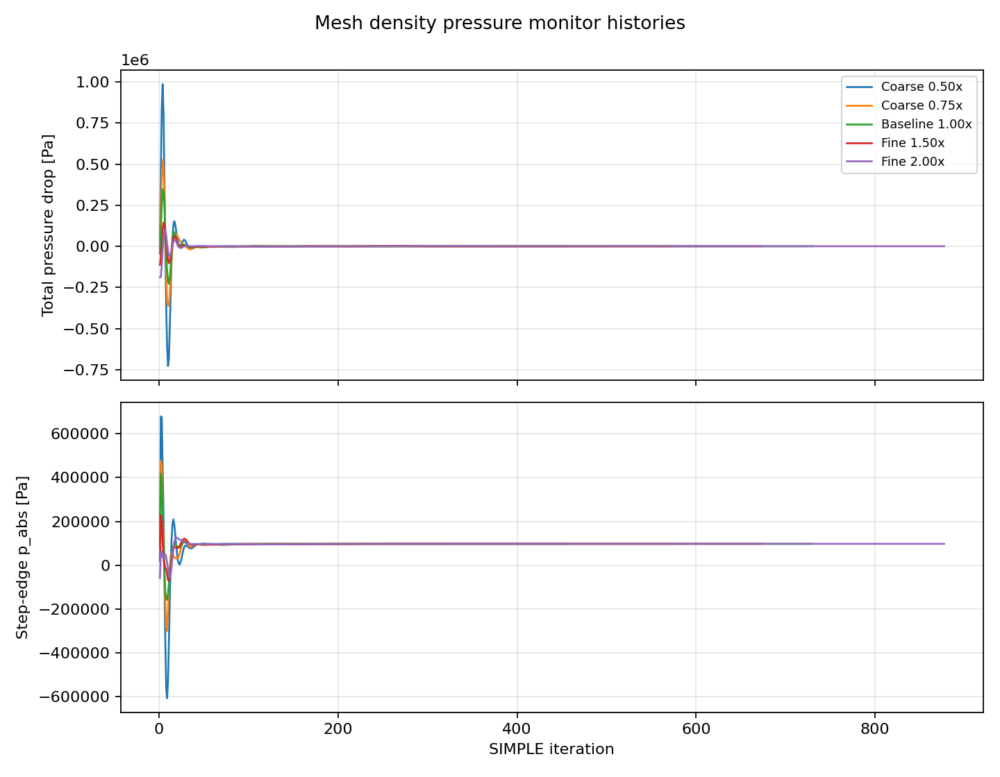

# Mesh Density Study

This study evaluates how the current backward-facing-step pressure KPIs change with mesh density. The physics, boundary conditions, numerics, convergence targets, and pressure probe locations are held fixed. Only the structured `blockMesh` cell counts are changed.

The sweep is generated and run with:

```bash
./scripts/run_mesh_study.py --force
```

The generated OpenFOAM run directories are intentionally ignored by Git. The committed study artifacts are the summary CSV, combined history CSV, per-mesh monitor CSVs, residual CSVs, and plots.

## Mesh Levels

| Variant | Cells | Upstream block | Lower downstream block | Upper downstream block |
| --- | ---: | --- | --- | --- |
| Coarse 0.50x | 1050 | `15x10x1` | `60x5x1` | `60x10x1` |
| Coarse 0.75x | 2400 | `22x15x1` | `90x8x1` | `90x15x1` |
| Baseline 1.00x | 4200 | `30x20x1` | `120x10x1` | `120x20x1` |
| Fine 1.50x | 9450 | `45x30x1` | `180x15x1` | `180x30x1` |
| Fine 2.00x | 16800 | `60x40x1` | `240x20x1` | `240x40x1` |

All five meshes passed `checkMesh`.

## KPI Summary

| Variant | Cells | Residual trigger | Final iteration | Total pressure drop [Pa] | Step-edge p_abs [Pa] |
| --- | ---: | ---: | ---: | ---: | ---: |
| Coarse 0.50x | 1050 | 256 | 456 | 752.992455 | 97774.3375 |
| Coarse 0.75x | 2400 | 374 | 574 | 898.6085946 | 97765.28475 |
| Baseline 1.00x | 4200 | 530 | 730 | 942.5217573 | 97767.56325 |
| Fine 1.50x | 9450 | 473 | 673 | 828.5751988 | 97777.841 |
| Fine 2.00x | 16800 | 677 | 877 | 867.4141734 | 97780.83 |





## Outputs

| File | Description |
| --- | --- |
| `mesh_density_results.csv` | One-row-per-mesh KPI summary |
| `mesh_density_histories.csv` | Combined pressure monitor histories for all mesh levels |
| `mesh_density_kpis.png` | KPI sensitivity versus cell count |
| `mesh_density_convergence.png` | Pressure monitor histories for all mesh levels |
| `<variant>/pressure_monitors.csv` | Per-variant pressure monitor history |
| `<variant>/residuals.csv` | Per-variant residual history |

## Initial Interpretation

The step-edge absolute pressure changes by roughly `15.5 Pa` across this first sweep, while total pressure drop varies more strongly and non-monotonically. That behavior is useful for the portfolio because it shows that a single point-to-point pressure-drop probe is mesh-sensitive in this separated-flow case.

The next improvement should add sampled outlet and upstream section averages, plus downstream velocity profiles, so the mesh study can compare both point probes and area/profile-based quantities.
